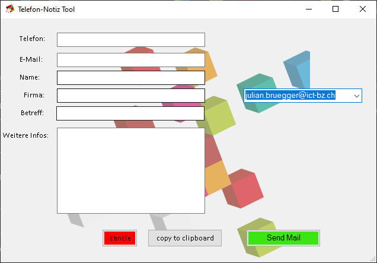

# 3cx-Notes
Für die bei uns im Betrieb angewendete 3cx Telefonlösung habe ich eine Notizsoftware erstellt. 

Diese ist einfach aufgebaut und ist kinderleicht zu bedienen. Basierend ist diese auf Powershell. 


## Setup

Im Hauptmenü werden die Einstellungen unten rechts geöffnet. 

Danach können die erweiterten Einstellungen geöffnet werden.

Im Submenü verhalten kann nun die Software hinzugefügt werden. 


Nun können die Einstellungen vom Printscreen übernommen werden. 

- Die Anwendung soll bei einem eingehenden Anruf gestartet werden. 
- Der Pfad zur `.EXE` Datei
- Und die Parameter sollen auch mitgegeben werden
```ps1
%CallerNumber% %CallerDisplayName%
```

## Reflexion

### Positiv

Das Programm zu schreiben war nicht anspruchsvoll. im Hintergrund verteile ich eigentlich nur `strings`.

### Schwierigkeiten

Das schwere war für mich das Generieren des GUI's. Dafür habe ich im Internet ein [Tool](https://poshgui.com/Editor?Tab=1) gefunden welches solche GUIS automatisch erstellt, bzw. ich erstelen kann. Dies hat es mir um einigis einfacer gemacht. Auch das Erstellen einer .EXE Datei war für mich neu, auch dafüpr gibt es aber ein [Tool](https://gallery.technet.microsoft.com/scriptcenter/PS2EXE-GUI-Convert-e7cb69d5) von Microsoft. 